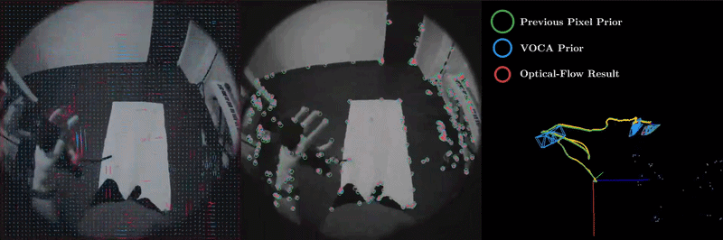

<div align="center">

<h1><u>VOCA</u> 📹</h1>
<h2>Visual Odometry with Codec Awareness</h2>

<p>
  <a href="https://www.linkedin.com/in/nourihilscher/">Nouri Alexander Hilscher</a><sup>*1</sup>
  &nbsp;·&nbsp;
  <a href="https://cvg.cit.tum.de/members/mayom">Mateo de Mayo</a><sup>*1,2</sup>
  &nbsp;·&nbsp;
  <a href="https://dominikmuhle.github.io/">Dominik Muhle</a><sup>1,2</sup>
  &nbsp;·&nbsp;
  <a href="https://www.linkedin.com/in/christoph-otten-genannt-hermes-4106662b7/">Christoph Otten genannt Hermes</a><sup>1</sup>
  &nbsp;·&nbsp;
  <a href="https://cvg.cit.tum.de/members/cremers">Daniel Cremers</a><sup>1,2</sup>
</p>

<p>
  <sup>1</sup> Technical University of Munich, Munich, Germany<br>
  <sup>2</sup> Munich Center for Machine Learning, Munich, Germany
</p>

<p>
  <sup>* Equal contribution</sup>
</p>

<h3>ECCV 2026 &nbsp; <strong>🌟 SPOTLIGHT 🌟</strong></h3>

<p>
  <a href="https://arxiv.org/abs/2607.00189"><strong>Paper</strong></a>
  &nbsp;|&nbsp;
  <a href="https://tum-vision.github.io/voca"><strong>Project Page</strong></a>
  &nbsp;|&nbsp;
  <a href="https://github.com/tum-vision/voca"><strong>Code</strong></a>
</p>



</div>


## 📋 Abstract

Camera pose estimation from image streams is a critical component of spatial world models that integrate perception for planning and decision making. Nearly all visual odometry (VO) and SLAM systems have focused on datasets containing raw and uncompressed videos. Many working systems, instead, use ubiquitous hardware units to compress and decode video streams efficiently, saving orders of magnitude in space and bandwidth. However, this lossy compression introduces visual artifacts that hinder the performance of traditional tracking systems. In this work, we present VOCA, a causal stereo visual-odometry method that exploits codec information to improve tracking performance. We achieve state-of-the-art performance on causal VO for relative trajectory error, efficiency, and absolute trajectory error on compressed streams.


## 🛠️ Installation

Ubuntu 24.04 is the recommended platform. VOCA requires CMake 3.27 or newer.

Clone the repository together with all submodules:

```bash
git clone --recursive https://github.com/tum-vision/voca.git
cd voca
```

Install the system dependencies. The script has only been tested on Ubuntu 24.04. Package mappings for Homebrew on macOS, DNF on Fedora, and APT on Debian are also provided but remain untested:

```bash
# Required before the first installation on Ubuntu and Debian
sudo apt-get update

./scripts/install_deps.sh
```

Build VOCA using `release` for the optimized standalone executable and visualization UI, `development` for the same targets with debug symbols, or `library` for only `libbasalt.so`:

```bash
cmake --preset release # Replace with "development" or "library" as needed.
cmake --build build --parallel 4
```

For a standalone build, verify the installation:

```bash
./build/basalt_vio --help
ffmpeg -hide_banner -encoders | grep libx264
```


## 🗂️ Datasets and Configurations

The paper evaluation uses the following configuration and calibration files. All datasets are presented to VOCA in the EuRoC directory layout and use `--dataset-type euroc`.

| Dataset | Device name | Configuration | Calibration |
|---|---|---|---|
| EuRoC | `euroc` | [`data/euroc/euroc_config_vo.json`](data/euroc/euroc_config_vo.json) | [`data/euroc/euroc_ds_calib.json`](data/euroc/euroc_ds_calib.json) |
| TUM-VI | `tumvi` | [`data/tum/tumvi_512_config_vo.json`](data/tum/tumvi_512_config_vo.json) | [`data/tum/tumvi_512_ds_calib.json`](data/tum/tumvi_512_ds_calib.json) |
| Monado Odyssey+ | `msdmo` | [`data/msd/msdmo_config_vo.json`](data/msd/msdmo_config_vo.json) | [`data/msd/msdmo_calib.json`](data/msd/msdmo_calib.json) |
| Monado Valve Index | `msdmi` | [`data/msd/msdmi_config_vo.json`](data/msd/msdmi_config_vo.json) | [`data/msd/msdmi_calib.json`](data/msd/msdmi_calib.json) |
| Monado Reverb G2 | `msdmg` | [`data/msd/msdmg_config_vo.json`](data/msd/msdmg_config_vo.json) | [`data/msd/msdmg_calib.json`](data/msd/msdmg_calib.json) |

The mapping between sequence names, device names, configurations, calibrations, and evaluation sets is stored in [`.ci/evaluation.json`](.ci/evaluation.json).

### Run Data

The evaluation run data can be downloaded from [LRZ Sync+Share](https://syncandshare.lrz.de/getlink/fiLDC6W1bSxx1WdKcPLJZe/VOCA). The `mvofckf` directory contains the results for the version presented in the paper.


## 🎞️ Video Encoding and Decoding

VOCA expects one H.264 video per camera at the following locations:

```text
<video-dataset>/mav0/cam0/data.mp4
<video-dataset>/mav0/cam1/data.mp4
```

The main paper configuration uses:

- `libx264`
- Two-pass encoding
- A target bitrate of 500 kbit/s
- 30 frames per second
- `yuv420p`
- No audio
- `partitions=p8x8,p4x4,i8x8:keyint=1000:me=umh:merange=64:subme=6:bframes=0:ref=1`

These settings are defined in each dataset configuration listed above. The pixel format defaults to `yuv420p` in [`.ci/get_dataset.py`](.ci/get_dataset.py).

Use the dataset preparation helper so that frames follow `data.csv` order and stereo timestamps remain consistent. Select the configuration and device name from the table above. For EuRoC, run:

```bash
DATASET=/path/to/MH_01_easy
WORKDIR=/path/to/fast-working-directory
CONFIG=data/euroc/euroc_config_vo.json
DEVICE=euroc

mkdir -p "$WORKDIR"

python3 -u .ci/get_dataset.py \
  "$DATASET" \
  "$WORKDIR" \
  --config_path "$CONFIG" \
  --device "$DEVICE"
```

If the dataset is stored as an archive, pass the archive path without the `.zip` suffix. Generated videos are written to:

```text
<WORKDIR>/videos/<DEVICE>/<SEQUENCE>/mav0/cam*/data.mp4
```

The script prints `VIDEO_PATH=<path>` followed by the final dataset path on its last line. The final dataset path can differ from the original path when camera timestamps need to be filtered to their shared timestamps.

No separate decoding step is needed. VOCA decodes compressed frames internally through OpenCV. When motion vectors are enabled, the FFmpeg decoder also exports codec motion vectors through frame side data.

A paper-style EuRoC can be executed like this:

```bash
DATASET=/path/to/dataset/files
VIDEO_DATASET=/path/to/compressed/video/frames
CONFIG=data/euroc/euroc_config_vo.json
CALIB=data/euroc/euroc_ds_calib.json

./build/basalt_vio \
  --dataset-path "$DATASET" \
  --video-dataset-path "$VIDEO_DATASET" \
  --dataset-type euroc \
  --cam-calib "$CALIB" \
  --config-path "$CONFIG" \
  --use-video-frames 1 \
  --use-mvs 1 \
  --use-imu 0 \
  --deterministic 1 \
  --num-threads 4 \
  --show-gui 0 \
  --save-times 1 \
  --save-trajectory euroc \
  --save-trajectory-fn tracking.csv
```

`--dataset-path` supplies timestamps, metadata, IMU data, and ground truth. `--video-dataset-path` supplies the compressed camera streams and may point to a different root.


## 🧪 Ablations

The current code supports all four paper variants through the dataset configuration and the `--use-mvs` runtime option.

| Variant | Paper tag | `config.use_mvs` | `config.optical_flow_subtype` | Runtime option | Tracking order |
|---|---|---:|---|---|---|
| Optical flow | `1.base` | `false` | Ignored when motion vectors are disabled | `--use-mvs 0` | Standard optical flow on decoded frames |
| Optical flow with motion vector fallback | `2.ofmv` | `true` | `F2F_OF_FALLBACK_MV` | `--use-mvs 1` | Optical flow first, then motion vector initialized optical flow for lost points |
| Motion vector initialized optical flow | `3.mvof` | `true` | `F2F_MV_FALLBACK_OF` | `--use-mvs 1` | Motion vector initialized optical flow first, then standard optical flow for lost points |
| Motion vector and optical flow consensus | `4.mvofc` | `true` | `OF_MVOF_CONSENSUS` | `--use-mvs 1` | Motion vector initialized and standard optical flow are compared |

The consensus configuration additionally uses a tolerance value:

```json
"config.optical_flow_consensus_tolerance": 0.05
```

All four variants use compressed video frames and visual-only odometry:

```json
"config.use_video_frames": true,
"config.use_imu": false
```

## ⚙️ Evaluation

Instructions for reproducing the evaluation and generating metrics with [`xrtslam-metrics`](https://gitlab.freedesktop.org/mateosss/xrtslam-metrics) are available in [`.ci/README.md`](.ci/README.md).


## 📊 Visualization

The visualization UI is built together with `basalt_vio` by the `release` and `development` presets. It uses the bundled Pangolin submodule and the OpenGL dependencies installed by `scripts/install_deps.sh`.

Start the UI by changing the run command to:

```bash
./build/basalt_vio \
  --dataset-path "$FINAL_DATASET" \
  --video-dataset-path "$VIDEO_DATASET" \
  --dataset-type euroc \
  --cam-calib "$CALIB" \
  --config-path "$CONFIG" \
  --use-video-frames 1 \
  --use-mvs 1 \
  --use-imu 0 \
  --show-gui 1 \
  --step-by-step 1
```

The window contains the stereo camera views, the estimated 3D trajectory, and diagnostic plots. Open **Features Menu** to enable the codec visualizations:

- **show_motion_vectors** draws motion vectors from codec source positions to destination positions.
- **show_macro_blocks** draws translucent codec block rectangles with colored outlines based on the reference direction.

Both overlays require encoded `data.mp4` files and `--use-mvs 1`. The first encoded frame is normally an I-frame and has no motion vectors. Advance to a P-frame before checking the overlays.


## 📚 BibTeX
If you find our work useful, please consider citing our paper:
```bibtex
@inproceedings{hilscher2026Voca,
  author    = {Hilscher, Nouri Alexander and de Mayo, Mateo and Muhle, Dominik and Otten genannt Hermes, Christoph and Cremers, Daniel},
  title     = {VOCA: Visual Odometry with Codec Awareness},
  booktitle = {European Conference on Computer Vision (ECCV 2026)},
  year      = {2026},
}
```

## 🗣️ Acknowledgements
This work was supported by the European Research
Council (ERC) Advanced Grant SIMULACRON, by the DFG project CR 250/26-
1 “4D-YouTube”, by the GNI Project “AI4Twinning”, and by the Munich Center
for Machine Learning.

Our work builds on the [Basalt codebase](https://github.com/VladyslavUsenko/basalt)
and the [newer implementation](https://gitlab.freedesktop.org/mateosss/basalt) described in the
[Monado SLAM Dataset paper](https://arxiv.org/pdf/2508.00088).
